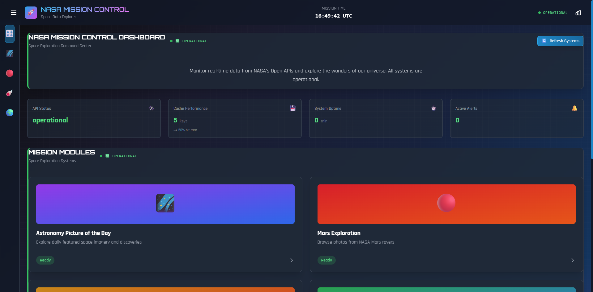
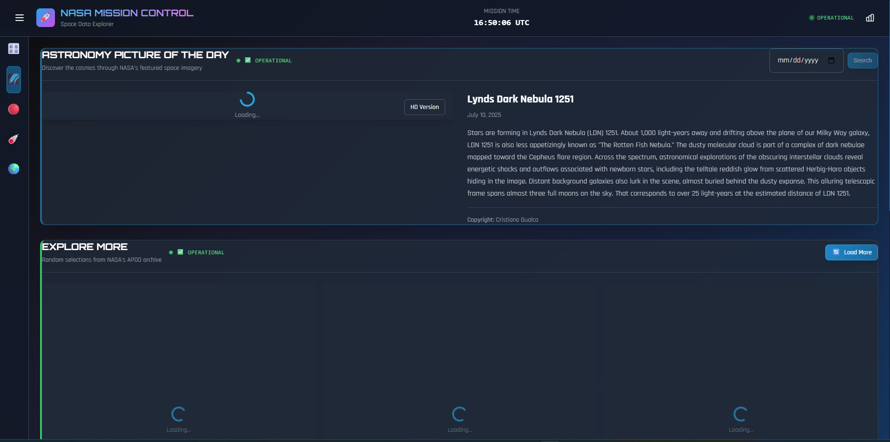
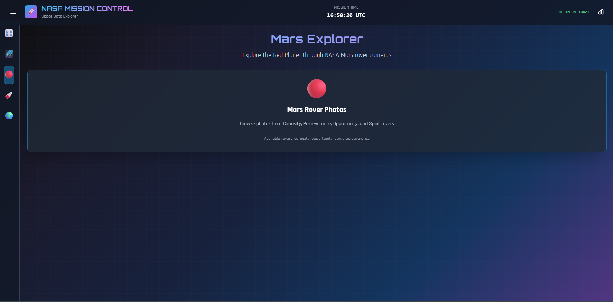
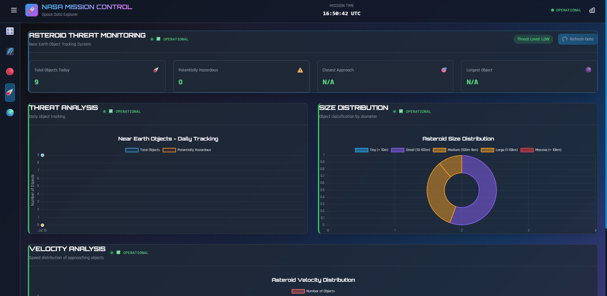
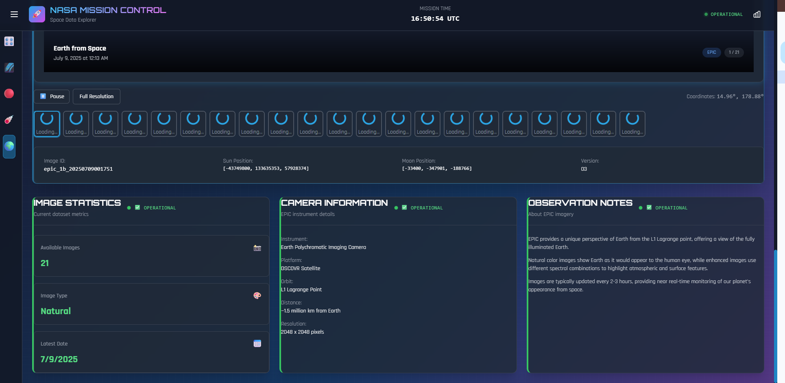

# NASA Mission Control Dashboard

This is a modern, interactive web application that provides real-time access to NASA's space data through their public APIs. Built with React, Node.js, and featuring an authentic space mission control aesthetic with comprehensive accessibility and performance optimization.


## Features

### NASA Data Integration
- **Astronomy Picture of the Day (APOD)**: Daily space images with detailed descriptions and HD viewing
- **Mars Rover Photos**: Explore images from NASA's Mars rovers (Curiosity, Opportunity, Spirit, Perseverance)
- **Near Earth Objects (NEO)**: Track asteroids and comets approaching Earth with threat assessment
- **Earth Observation**: View real-time Earth imagery from NASA's EPIC camera with natural/enhanced modes
- **Interactive Search & Filtering**: Advanced search capabilities with date ranges and content filters

### Data Visualization & Analytics
- **Interactive Charts**: Real-time asteroid tracking, size distribution, and velocity analysis
- **System Performance Monitoring**: Live performance metrics with memory usage and API tracking
- **Image Galleries**: Comprehensive photo galleries with modal viewing and metadata display
- **Real-time Updates**: Live data feeds with automatic refresh and caching optimization

### Mission Control Experience
- **Authentic NASA UI**: Space-themed interface with mission control aesthetics
- **Responsive Design**: Seamless experience across desktop, tablet, and mobile devices
- **Smooth Animations**: Fluid transitions with reduced motion support for accessibility

## Technology Stack

### Frontend
- **React 18** - Modern UI library with hooks and concurrent features
- **Vite** - Lightning-fast build tool and development server
- **Tailwind CSS** - Utility-first CSS framework with custom space theme
- **Chart.js** - Interactive data visualization with space-themed styling
- **React Router** - Client-side routing with lazy loading
- **Axios** - HTTP client with interceptors and error handling
- **Framer Motion** - Smooth animations with accessibility support
- **Lucide React** - Beautiful, consistent icon library

### Backend
- **Node.js** - JavaScript runtime with ES6+ features
- **Express.js** - Web application framework with security middleware
- **Node-cache** - In-memory caching with TTL and statistics
- **Helmet** - Security middleware for HTTP headers
- **CORS** - Cross-origin resource sharing configuration
- **Rate Limiting** - API protection with configurable limits
- **Image Proxy** - NASA image proxy to handle CORS and timeouts

### Development & Deployment
- **ESLint** - Code linting with React and accessibility rules
- **Prettier** - Code formatting for consistency
- **Nodemon** - Development server with hot reload
- **Environment Configuration** - Secure environment variable management

## Project Structure

```
nasa-mission-control-dashboard/
├── frontend/                 # React application
│   ├── src/
│   │   ├── components/      # Reusable UI components
│   │   ├── pages/          # Page components
│   │   ├── services/       # API service layer
│   │   ├── hooks/          # Custom React hooks
│   │   ├── utils/          # Utility functions
│   │   └── styles/         # Global styles and themes
│   ├── public/             # Static assets
│   └── package.json
├── backend/                 # Express.js server
│   ├── src/
│   │   ├── routes/         # API route handlers
│   │   ├── middleware/     # Custom middleware
│   │   ├── services/       # NASA API integration
│   │   └── utils/          # Backend utilities
│   ├── .env.example        # Environment variables template
│   └── package.json
└── README.md               # This file
```

## Quick Start

## Prerequisites

Before you begin, ensure you have the following installed:
- **Node.js** (version 16.0 or higher) - [Download here](https://nodejs.org/)
- **npm** (version 7.0 or higher) - Comes with Node.js
- **Git** (for cloning the repository) - [Download here](https://git-scm.com/)

### 1. Clone the Repository
```bash
git clone <repository-url>
cd nasa-mission-control-dashboard
```

### 2. Install Dependencies

Install backend dependencies:
```bash
cd backend
npm install
```

Install frontend dependencies:
```bash
cd frontend
npm install
```

### 3. Environment Configuration

Edit the `.env` file with your NASA API key:
```env
NODE_ENV=development
PORT=5000
NASA_API_KEY=CJx1Hkyu2rgNZK7UrP2QvdYg1QLF1saUOLueU7cG
CORS_ORIGIN=http://localhost:3000
CACHE_TTL=300000
RATE_LIMIT_WINDOW=900000
RATE_LIMIT_MAX=100
```

**Frontend (.env):**
```bash
cd frontend
echo "VITE_API_BASE_URL=http://localhost:5000/api" > .env
echo "VITE_APP_NAME=NASA Mission Control Dashboard" >> .env
echo "VITE_APP_VERSION=1.0.0" >> .env
```

### 4. Start the Application

Start the backend server:
```bash
cd backend
npm run dev
```

In a new terminal, start the frontend:
```bash
cd frontend:
npm run dev
```

Or, in the root directory:
```bash
npm install
npm run dev
```

### 5. Access the Application

- **Frontend**: http://localhost:3000
- **Backend API**: http://localhost:5000
- **API Health Check**: http://localhost:5000/api/health
- **Performance Monitor**: Available in development mode (click the chart icon in header)

## API Endpoints

### Health & System
- `GET /api/health` - Server health status and system metrics
- `GET /api/proxy/cache/stats` - Image cache statistics

### Image Proxy
- `GET /api/proxy/image?url=<nasa_image_url>` - Proxy NASA images to avoid CORS
- `GET /api/proxy/thumbnail?url=<nasa_image_url>` - Generate/proxy thumbnails

### APOD (Astronomy Picture of the Day)
- `GET /api/apod/today` - Today's APOD with metadata
- `GET /api/apod/date/:date` - APOD for specific date (YYYY-MM-DD)
- `GET /api/apod/random` - Random APOD from archive
- `GET /api/apod/range?start_date=YYYY-MM-DD&end_date=YYYY-MM-DD` - Date range

### Mars Rover Photos
- `GET /api/mars/rovers` - List of available rovers with status
- `GET /api/mars/photos/:rover` - Latest photos from specific rover
- `GET /api/mars/photos/:rover/:sol` - Photos from specific sol (Mars day)
- `GET /api/mars/photos/:rover/camera/:camera` - Photos from specific camera

### Near Earth Objects (NEO)
- `GET /api/neows/today` - Today's NEO data with threat assessment
- `GET /api/neows/feed?start_date=YYYY-MM-DD&end_date=YYYY-MM-DD` - NEO feed
- `GET /api/neows/stats` - NEO statistics and analytics

### Earth Observation (EPIC)
- `GET /api/epic/latest` - Latest EPIC images with metadata
- `GET /api/epic/date/:date` - EPIC images for specific date
- `GET /api/epic/natural` - Natural color images
- `GET /api/epic/enhanced` - Enhanced color images

## Environment Variables

### Backend Production Variables
```env
NODE_ENV=production
PORT=5000
NASA_API_KEY=your_production_nasa_api_key
CORS_ORIGIN=https://your-frontend-domain.com
CACHE_TTL=600000
RATE_LIMIT_WINDOW=900000
RATE_LIMIT_MAX=1000
```

### Frontend Production Variables
```env
VITE_API_BASE_URL=https://your-backend-domain.com/api
VITE_APP_NAME=NASA Mission Control Dashboard
VITE_APP_VERSION=1.0.0
VITE_ENVIRONMENT=production
```

## Testing

### Running Tests

```bash
# Backend tests
cd backend
npm test

# Frontend tests
cd frontend
npm test

# Accessibility testing
npm run test:a11y

# Performance testing
npm run test:performance
```





